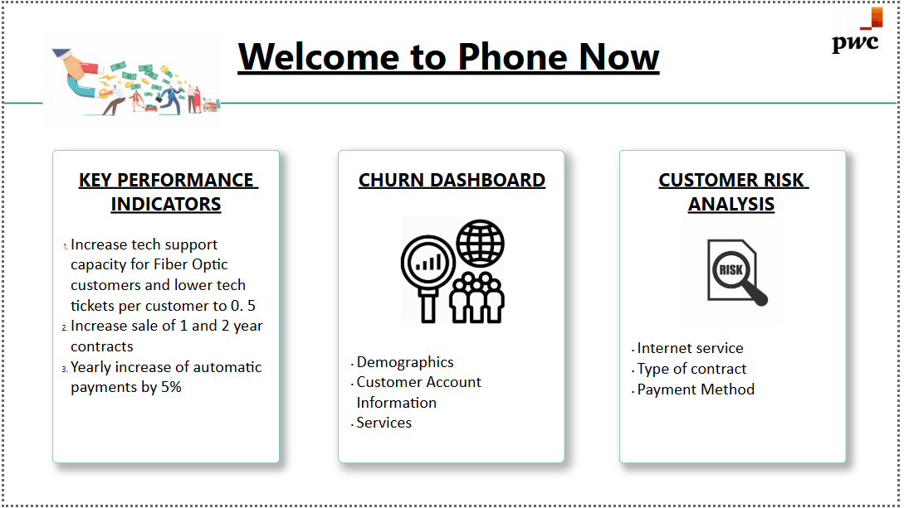
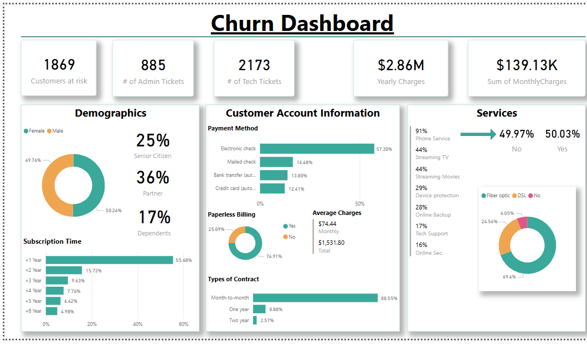

# Customer-Retention-Dashboard

An interactive Power BI dashboard designed to analyze customer retention and churn behavior across cohorts and time periods. Helps businesses identify drop-off trends and make data-driven retention decisions.

## 🔍 Key Features:
Cohort-wise retention and churn analysis

Metrics: Repeat Purchase Rate, CLV, Engagement Trends

Interactive drill-down visuals for customer journey insights

Actionable insights to enhance retention strategies

Tools Used: Power BI, DAX

## 📸 Dashboard Previews
 
 

